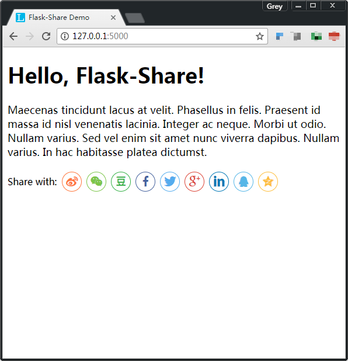

# Flask-Share

Create social share component in Jinja2 template based
on [share.js](https://github.com/overtrue/share.js/).

## Links

* [Documentation](https://flask-share.readthedocs.io/en/latest/)
* [PyPI](https://pypi.org/project/Flask-Share/)

## Screenshot

## License

This project is licensed under the MIT License (see the
`LICENSE` file for details).
